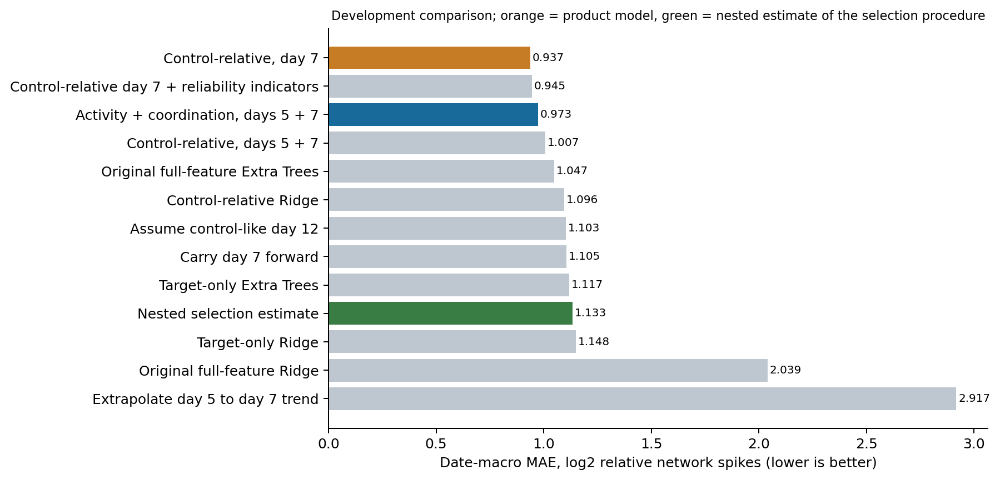
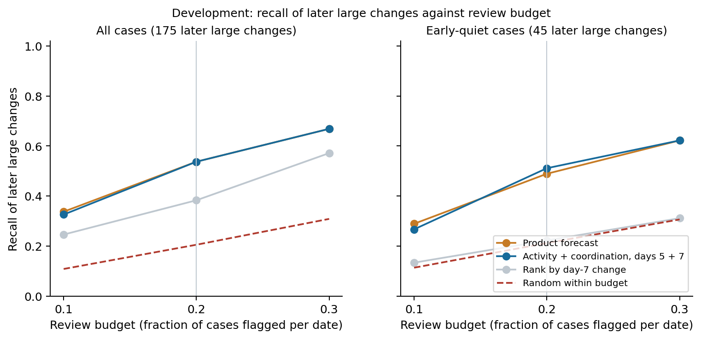
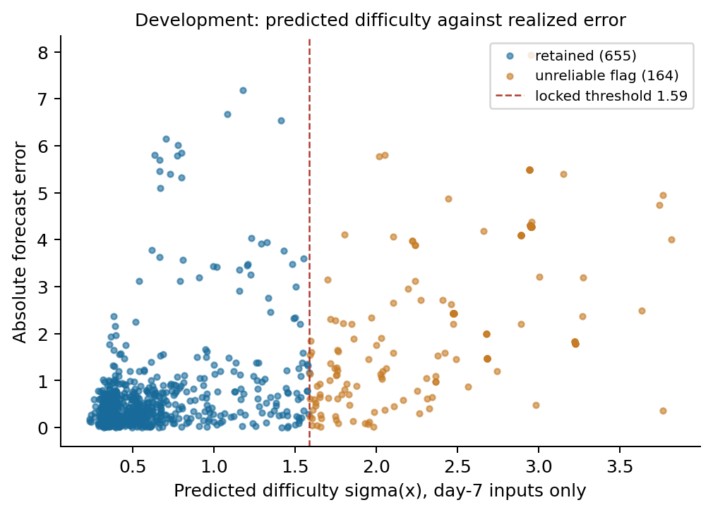
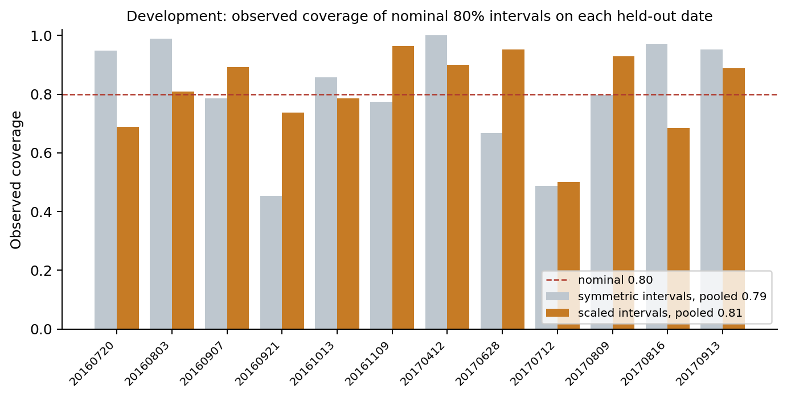

**NeuroForecast validation gate: the development stage.** First run on September 21, 2026 IST under gate protocol v1; re-run unchanged under [the amended v1.1 protocol](neuroforecast_gate_protocol.md) (JSON SHA-256 `16679e20133841b0381a9e97c8184d8ed4b065e03cae1bbbebe03c042963947a`), which is the run whose artifacts are published. Its development lock has SHA-256 `e81011d946745fb96c8d3f5208e10e6ab73a0f9342b6553897df70c9f8eca4be`. Every forecast, error and warning count below is identical between the two runs; the determinism fix recorded in the protocol changed only the difficulty model and the quantities derived from it, which are quoted here from the published run. Machine-readable values: [the compact summary](neuroforecast_gate_summary.json).

**Headline.** The forecast accuracy story did not get stronger: the day-7 control-relative model remains the best full-development candidate (MAE 0.93711) and reproduces the frozen selection numbers exactly, but a nested estimate of the selection procedure is 1.13295, no better than carrying day 7 forward (1.10480), and adding day-7 reliability indicators to the model does not help (0.94465). The reliability story is the strong result: a day-7 difficulty model separates cases whose forecasts should not be trusted (abstained-case MAE 2.216 versus retained-case MAE 0.676 at an 80% retention rate), conformal intervals reach their nominal coverage pooled across held-out dates (0.807 at nominal 0.80, 0.900 at 0.90), and the day-7 control-dispersion flag identifies every case of the plate group whose day-12 controls collapsed. Both learned forecasts roughly double the recall of the naive "rank by what already changed" rule at a 20% review budget among early-quiet conditions; they are indistinguishable from each other.

**Consistency with the frozen results.** The gate reproduces the 819-case feature matrix and targets of `neuroforecast_selection_v1` with zero difference, and its full-development predictions for the seven initial and four follow-up models match the frozen prediction files to `1.8e-15` (5,733 and 3,276 rows compared). Twelve saved product models replay their recorded forecasts (`1.8e-15`). The reliability indicators rebuild exactly, are invariant to mutating every measurement after day 7, and are identical when only days 5 and 7 are supplied. Twelve outer and 131 inner folds were checked for date and identity disjointness. Runtime 211 s on the local CPU.

**Forecast comparison and the nested estimate.** Date-macro MAE in log2 relative network-spike units, 12 held-out dates with purged identities:

| Candidate | MAE | Note |
| --- | ---: | --- |
| Control-relative Extra Trees, day 7 | **0.93711** | Product model by the locked rule |
| Control-relative day 7 + seven reliability indicators | 0.94465 | The one new candidate; gain 0.8%, interval -7.0% to +6.2%, 5/12 dates |
| Activity/coordination Extra Trees, days 5 + 7 | 0.97339 | Strongest simple comparator; product gain 3.7%, interval -3.5% to +9.8%, 9/12 dates |
| Control-relative, days 5 + 7 | 1.00725 | |
| Original full-feature Extra Trees | 1.04736 | |
| Control-relative Ridge | 1.09569 | |
| Control reference (predict no change) | 1.10345 | Product gain 15.1%, interval -14.5% to +37.3%, 7/12 dates |
| Persistence (carry day 7 forward) | 1.10480 | Product gain 15.2%, interval -22.3% to +39.9%, 9/12 dates |
| **Nested selection estimate** | **1.13295** | Inner purged leave-one-date-out chose the candidate; its outer error is recorded |
| Target-only Extra Trees / Ridge | 1.11721 / 1.14832 | |
| Full-feature Ridge; linear trend | 2.03921; 2.91720 | |



The nested procedure chose the day-7 model on six outer dates, the reliability variant on three and the original full-feature model on three. The two catastrophic outer losses came from the full-feature choice: 2.808 on 20160921 and 2.500 on 20170816, where the product model scored 2.561 and 0.617. Restricting the choice to the control-relative family gives 0.988, but that is a post hoc restriction and is not the primary number. The honest reading: with 11 inner dates, model selection among the top candidates is noisy, the full-feature model is batch-unstable, and 0.937 is a post-selection value. The sealed reserve is the first evaluation of this specific fixed model without selection.

**Warning decision.** Within each date, the top 20% of cases by score are flagged. Pooled over the 12 dates:

| Policy | All cases: detected / 175, false alerts | Early-quiet cases: detected / 45, false alerts, recall |
| --- | ---: | ---: |
| Product forecast magnitude | 94, 74 | 22, 67, **0.489** |
| Activity/coordination forecast magnitude | 94, 74 | 23, 66, 0.511 |
| Rank by day-7 change (persistence) | 67, 101 | 10, 79, 0.222 |
| Random within the budget (expected) | 36 | 9.5, 0.212 |

At 10% and 30% budgets the two learned policies also track each other (early-quiet recall 0.289/0.267 and 0.622/0.622), and both stay far above persistence ranking (0.133, 0.311). Ranking by day-7 change is no better than random among early-quiet cases, which follows from the subgroup's definition; the learned forecasts add real information there. The fixed threshold rule `abs(forecast) >= 1` reproduces the selection diagnostics (24 detected, 13 false alerts versus 23 and 8). Precision among early-quiet alerts is low for every policy (0.25 for the learned models at 20%), so the value is prioritization of a fixed review budget, not confident individual calls.



**Reliability: intervals and abstention.** Intervals are calibrated inside each outer fold on inner purged residuals, so no calibration residual comes from a model that saw the case's date or chemical.

| Interval | Pooled observed coverage | Mean width (log2 units) | Per-date range |
| --- | ---: | ---: | --- |
| Symmetric, nominal 0.80 | 0.795 | 2.73 | 0.45 to 1.00 |
| Scaled by difficulty, nominal 0.80 | **0.807** | 2.99 | 0.50 to 0.96 |
| Symmetric, nominal 0.90 | 0.886 | 5.83 | 0.46 to 1.00 |
| Scaled by difficulty, nominal 0.90 | 0.899 | 4.11 | 0.65 to 0.99 |

Pooled coverage is on target, but per-date coverage varies substantially because batches shift; the scaled intervals are more even across dates and narrower at 90%. Widths are large: a nominal-80% interval spans about three log2 units, an honest statement of how uncertain a day-12 forecast from day 7 is.

The difficulty model (Extra Trees on out-of-fold absolute residuals with day-7 inputs only) was thresholded at the development 80th percentile of predicted difficulty, sigma = 1.587, locked before any reserve scoring:

| Quantity | Value |
| --- | ---: |
| Retained cases | 655 of 819 (80.0%) |
| Retained-case MAE / abstained-case MAE | **0.678 / 2.210** |
| All-case MAE | 0.984 |
| Retained date-macro MAE | 0.778 |
| Retained observed coverage, scaled 0.80 | 0.785 |
| Share of total absolute error in the abstained cases | 45% |
| Excluding the worst date 20160921: retained / abstained MAE | 0.581 / 1.778 |



Retained-case MAE is below all-case MAE on 11 of 12 dates; on 20170412 it is 0.003 higher. The abstentions are not one bad plate: on 20170809 the tool abstains on 39 of 84 cases, where every plate's day-7 control median is between 0 and 2 network spikes (the networks had not developed by day 7) and the product model is worse than persistence (1.005 versus 0.698); retained MAE there is 0.650. On 20160907 it abstains on 22 of 56 and retained MAE falls from 1.017 to 0.421. These are held-out-date, held-out-chemical behaviours of a rule that reads only day-7 inputs.



**Measurement-quality flags.** Fixed display rules; the two percentile thresholds were locked at the development 90th percentile (replicate SD 1.714, control IQR ratio 1.481):

| Flag | Cases | Flagged MAE | Unflagged MAE | Reading |
| --- | ---: | ---: | ---: | --- |
| Controls disagree at day 7 | 42 (5.1%) | **4.645** | 0.787 | Exactly the 42 cases whose day-12 plate control median is below 5, all on 20160921. One plate-group event, so this is a single supporting observation, not a validated predictor. |
| Low reference activity at day 7 | 112 (13.7%) | 1.055 | 0.973 | Dates 20160907, 20170628, 20170809; weak association with error on its own. |
| Replicates disagree at day 7 | 82 (10.0%) | 0.765 | 1.009 | Not associated with larger error; the flag is informative about measurement scatter, not forecast error. |
| Few controls | 0 | | | No development plate had fewer than four usable controls. |
| Any flag | 224 (27.4%) | 1.576 | 0.762 | |

The threshold for the control-dispersion flag was derived on development data that include the affected plate, so the exact match is partly a consequence of where the 90th percentile fell; the reserve is its first genuine test.

**Outcome-quality sensitivity.** Excluding the 42 cases with a day-12 control median below 5 (777 remain), every learned model's error falls and the ordering is unchanged in substance: reliability variant 0.754, day-7 model 0.764, activity/coordination 0.776, control reference 1.005, persistence 1.057. The single degenerate plate group inflates every headline error; it was not removed from the primary results.

**What this changes in the entry's story.** The defensible contribution is the reliability layer around a modest forecast: a day-7 warning that prioritizes a review budget about twice as well as the naive rule, intervals whose observed coverage is reported per batch, an "unreliable forecast" flag that removes the worst errors, and a control-quality display that caught the one collapsed control plate. The forecast accuracy advantage over the smaller model is not established and the selection procedure itself is not better than persistence. The report should lead with those facts.

**Reserve.** Not scored. The `reserve` stage requires the unchanged lock and `--unseal`. Per the protocol it will run once and report every date. If the criteria are restructured before unsealing, the amendment must be dated in the protocol document, must precede the scoring, and must be disclosed as informed by these development results.

**Reproduction.**

```powershell
python -X utf8 -B -m unittest discover -s tests -p test_neuroforecast_gate.py -v
python -X utf8 -B tools/neuroforecast_gate.py --stage prepare --out E:/kaggle/AI4S/experiments/neuroforecast_gate_reproduction
python -X utf8 -B tools/neuroforecast_gate.py --stage develop --out E:/kaggle/AI4S/experiments/neuroforecast_gate_reproduction
python -X utf8 -B tools/neuroforecast_gate.py --stage audit --out E:/kaggle/AI4S/experiments/neuroforecast_gate_reproduction
python -X utf8 -B tools/report_neuroforecast_gate.py --out E:/kaggle/AI4S/experiments/neuroforecast_gate_reproduction
```

The prepare stage reads the frozen EPA archive (SHA-256 `fd92c1339bb764ee9b96c935bf31867c12640505e5c3f065ad5956a7eea08cfb`) through the unchanged frozen data core and compares its matrix with the completed selection run when that run is present. Packages are the pinned [NeuroForecast requirements](../tools/requirements-neuroforecast.txt).
