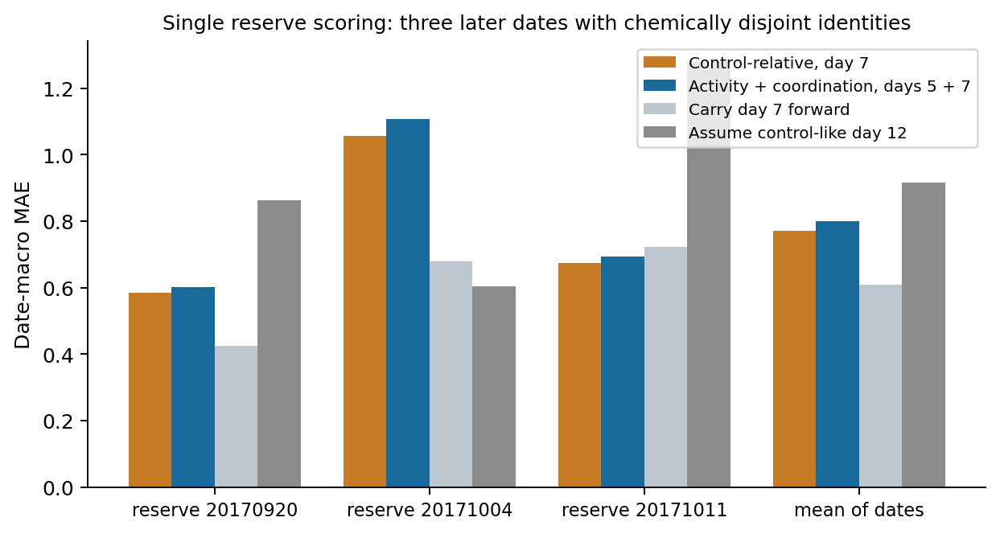
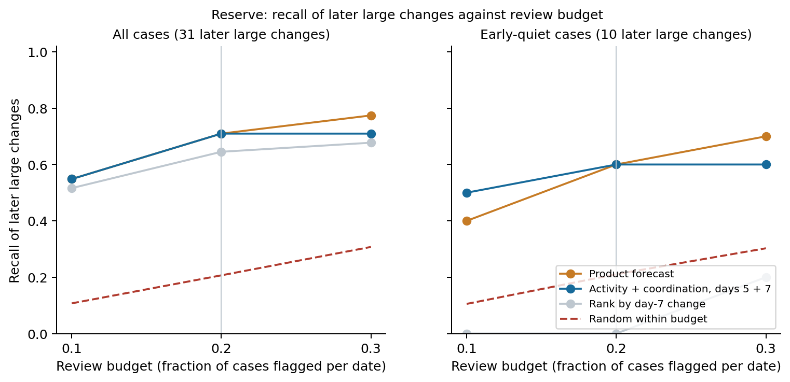
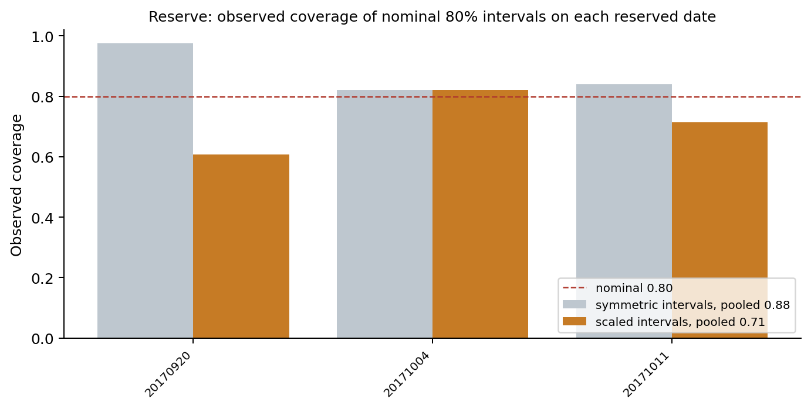
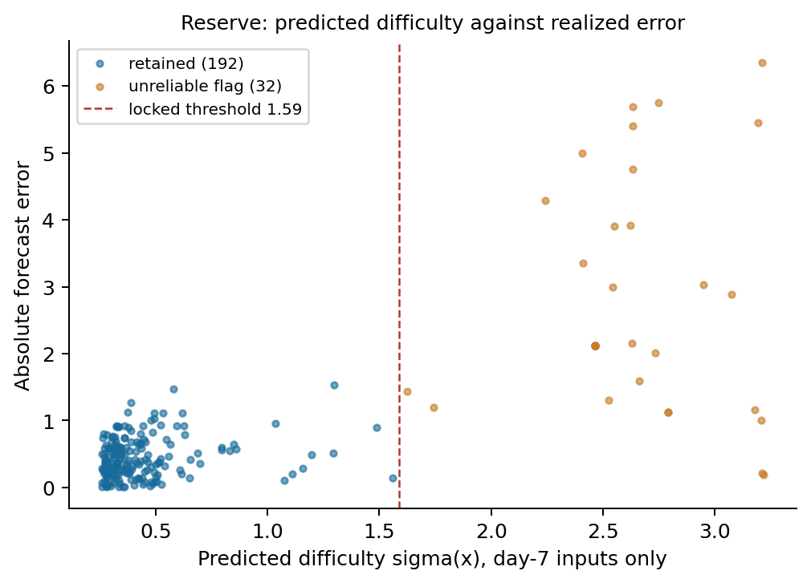

**The reserve has been scored once, on September 21, 2026 IST. The learned forecast did not beat carrying day 7 forward. The reliability layer did generalize.** This is the single authorized evaluation of the three reserved experiment dates under [protocol v1.1](neuroforecast_gate_protocol.md) (JSON SHA-256 `16679e20133841b0381a9e97c8184d8ed4b065e03cae1bbbebe03c042963947a`, the value the development lock records and the audit re-verifies). Nothing was tuned, excluded, or re-run afterwards. Development results are in [the gate development report](neuroforecast_gate_results.md); machine-readable values in [the compact summary](neuroforecast_gate_summary.json).

**Cohort.** 224 dose-condition cases, 32 chemical identities, three dates: 20170920 (84 cases, 12 identities), 20171004 (84, 12), 20171011 (56, 8). None of these identities appears anywhere in the 819 development cases. Every model was fit on all 819 development cases; conformal calibration used the full-development out-of-fold residuals; the locked abstention threshold (sigma 1.5868, development lock SHA-256 `e81011d946745fb96c8d3f5208e10e6ab73a0f9342b6553897df70c9f8eca4be`) and the two flag percentiles came from development.

**Criteria outcomes.**

| Criterion | Result | Numbers |
| --- | --- | --- |
| C1a forecast versus simple baselines | **FAIL** | Product 0.7716, persistence **0.6088**, control reference 0.9150. The product model beat persistence on one of three dates. |
| C1b forecast versus the smaller model | PASS | Product 0.7716 versus activity/coordination 0.8005; better on three of three dates. |
| C2a warning versus the naive rule | PASS | At the 20% budget among early-quiet cases: product recall 0.600 (6 of 10), persistence ranking 0.000, random expectation 0.211. |
| C2b warning versus the smaller model | PASS | Product 6 of 10, activity/coordination 6 of 10. |
| C3 reliability | PASS | Scaled intervals: pooled observed coverage 0.714 at nominal 0.80. Retained-case MAE 0.446 versus 0.784 for all cases. |
| C4 measurement display | Descriptive | Reported below. |

**Forecast error, per date.** Date-macro MAE in log2 relative network-spike units:

| Method | 20170920 | 20171004 | 20171011 | Mean of dates |
| --- | ---: | ---: | ---: | ---: |
| Carry day 7 forward (persistence) | **0.424** | 0.680 | 0.722 | **0.6088** |
| Target-only Ridge | | | | 0.6948 |
| Control-relative day 7 + reliability indicators | 0.655 | 0.917 | 0.724 | 0.7657 |
| **Product model: control-relative, day 7** | 0.583 | 1.057 | **0.674** | 0.7716 |
| Activity/coordination, days 5 + 7 | 0.600 | 1.107 | 0.694 | 0.8005 |
| Assume control-like day 12 | 0.863 | **0.604** | 1.278 | 0.9150 |
| Original full-feature Extra Trees | | | | 0.8749 |



The ordering among learned models held: the day-7 control-relative representation beat the smaller activity/coordination model on every reserved date, and the model with the added reliability indicators sat between them. What did not hold is the comparison that matters for a product claim: a rule that predicts no change from day 7 to day 12 was better on two of three dates and better overall. The reserved batches are more persistent than development: the correlation between the day-7 and day-12 relative readouts is 0.87 on the reserve against 0.54 on development, and 13.8% of reserve cases show a later large change against 21.4% on development. A forecaster trained where early measurements are weakly informative was applied where they are strongly informative, and the simple rule won.

**The failure has one dominant cause, and the day-7 quality flag found it.** On 20171004, all six plates had a day-7 zero-dose control median of exactly zero network spikes (ranges 0–3, 0–0, 0–1, 0–1, 0–3, 0–0); by day 12 the same plates recovered to medians of 23.5 to 53.5. The networks had not begun firing when the measurement the model depends on was taken. Every control-relative day-7 feature is then degenerate, and the model extrapolated to large negative forecasts: of its ten largest reserve errors, eight are on this date, including predictions near -5.0 for cases whose outcome was near +1. The locked `low_reference_activity` flag fired on all 84 cases of that date and on no other case (37.5% of the reserve; flagged MAE 1.057 versus unflagged 0.620), and the abstention rule marked 18 of those 84 unreliable. On the 140 unflagged reserve cases the product model scores 0.629 and persistence 0.573; the gap narrows but does not close.

**Warning decision.** Within each date the top 20% of cases by score are flagged:

| Policy | All cases: detected / 31, false alerts | Early-quiet: detected / 10, false alerts, recall |
| --- | ---: | ---: |
| Product forecast | 22, 24 | 6, 33, **0.600** |
| Activity/coordination | 22, 24 | 6, 33, 0.600 |
| Rank by day-7 change | 20, 26 | 0, 39, 0.000 |
| Random within budget (expected) | 6.4 | 2.1, 0.211 |



All ten early-quiet later-large-changes on the reserve are on 20171004, because that date's all-zero day-7 controls make every day-7 relative value exactly zero, so all of its cases are "early quiet" by the predefined rule and ranking by day-7 change carries no information at all there. The learned forecasts found 6 of 10, against a random expectation of 2.1. That is a real signal in the situation the tool was designed for — an early readout that shows nothing — but it rests on one batch and ten positive cases, and the same model's point forecasts on that batch were its worst. The honest summary is that ranking worked where the forecast magnitudes did not.

**Reliability.**

| Interval | Pooled observed coverage | Mean width | 20170920 | 20171004 | 20171011 |
| --- | ---: | ---: | ---: | ---: | ---: |
| Scaled, nominal 0.80 | **0.714** | 2.32 | 0.61 | 0.82 | 0.71 |
| Symmetric, nominal 0.80 | 0.884 | 2.75 | 0.98 | 0.82 | 0.84 |
| Scaled, nominal 0.90 | 0.893 | 3.13 | 0.85 | 0.95 | 0.88 |
| Symmetric, nominal 0.90 | 0.942 | 5.81 | 0.98 | 0.88 | 0.98 |



The scaled intervals under-cover at nominal 80% (0.714) and are close to nominal at 90% (0.893); the symmetric intervals over-cover at both levels because they carry the development error scale onto easier batches. C3's 0.70 threshold is met, but a 0.714 observation against a 0.80 nominal level is a shortfall and must be reported as one: under batch and chemical shift these intervals are approximate, not guaranteed.

Abstention transferred well. With the development-locked threshold the tool declines 32 of 224 reserve cases (14.3%), and those cases carry 51% of the model's total absolute error:

| Quantity | Product model | Persistence |
| --- | ---: | ---: |
| All-case MAE | 0.784 | 0.595 |
| Retained-case MAE (192 cases) | **0.446** | 0.433 |
| Abstained-case MAE (32 cases) | 2.813 | 1.566 |
| Retained date-macro MAE | 0.461 | 0.444 |



Abstention roughly halves the error of whichever forecaster it is applied to, on dates and chemicals it never saw, using only day-7 information. It does not change the ranking between the two forecasters: persistence remains slightly better on retained cases too.

**Measurement-quality flags on the reserve.** `low_reference_activity` fired on 84 cases (37.5%), all on 20171004, with MAE 1.057 against 0.620 unflagged. `replicates_disagree` fired on three cases (MAE 1.000 against 0.781). `controls_disagree` and `few_controls` fired on none; no reserve plate had a day-12 control median below 5, so the outcome-quality sensitivity subset is the whole reserve and the sensitivity analysis is identical to the primary result. The one flag that mattered on development (control dispersion, which isolated the collapsed plate group) had nothing to fire on here, and the one that mattered here (low day-7 reference activity) looked weak on development. Both are display elements with one supporting batch each.

**What this means for the entry.** Per the protocol's C1a failure clause, the claim narrows: we do not claim a forecasting advantage over trivial rules. Three statements survive this evaluation and are what the submission should be built on.

1. A day-7 difficulty model, calibrated with batch and chemical separation, identifies the conditions whose day-12 outcome cannot be predicted from day 7 — on unseen batches and chemicals, 14% of cases carrying half of all forecast error, and it improves persistence as well as the learned model.
2. A day-7 control-quality flag identified, prospectively and by a threshold fixed beforehand, the entire batch on which the learned forecast failed, before any day-12 data existed.
3. Where the day-7 readout is uninformative, ranking by learned forecast magnitude at a fixed review budget detected 6 of 10 later large changes against 2.1 expected by chance, while the naive rule detected none.

The honest framing of the product is therefore trust triage rather than better forecasting: which conditions can be forecast at all from day 7, which measurements should be repeated, and which conditions deserve the review budget. Persistence belongs in the tool as a first-class predictor, not only as a baseline. The competition report should lead with the failed criterion, because a reviewer who finds it after the claim will discount everything else.

**Reproduction.** The reserve stage runs once and refuses to run again; the outputs are hash-recorded in `reserve_manifest.json`, and the audit re-verified every hash, identity and date disjointness after scoring. A fresh reproduction repeats the development stage into a new directory and then unseals:

```powershell
python -X utf8 -B tools/neuroforecast_gate.py --stage prepare --out E:/kaggle/AI4S/experiments/neuroforecast_gate_repro
python -X utf8 -B tools/neuroforecast_gate.py --stage develop --out E:/kaggle/AI4S/experiments/neuroforecast_gate_repro
python -X utf8 -B tools/neuroforecast_gate.py --stage reserve --unseal --out E:/kaggle/AI4S/experiments/neuroforecast_gate_repro
python -X utf8 -B tools/neuroforecast_gate.py --stage audit --out E:/kaggle/AI4S/experiments/neuroforecast_gate_repro
python -X utf8 -B tools/report_neuroforecast_gate.py --out E:/kaggle/AI4S/experiments/neuroforecast_gate_repro
```

The development stage is bit-reproducible: two independent runs produced identical hashes for every prepared file, prediction file, interval file, flag file and fold record. The reserve stage took 11.8 seconds; development takes about 8.4 minutes single-threaded on the local CPU.
