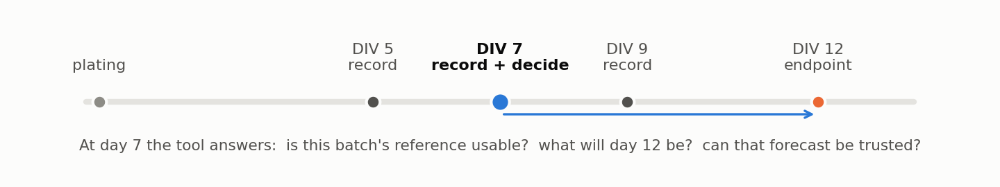
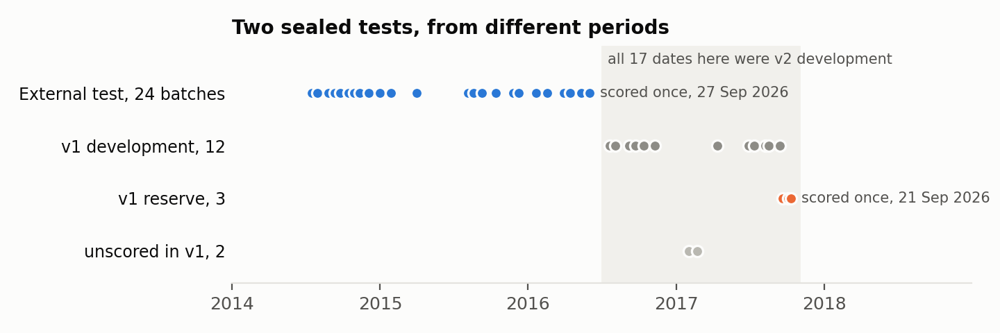
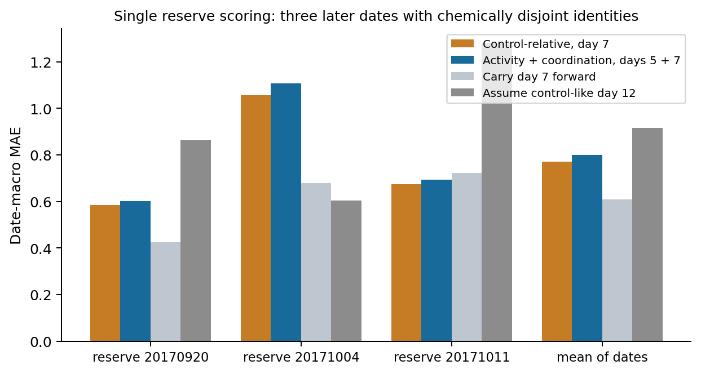
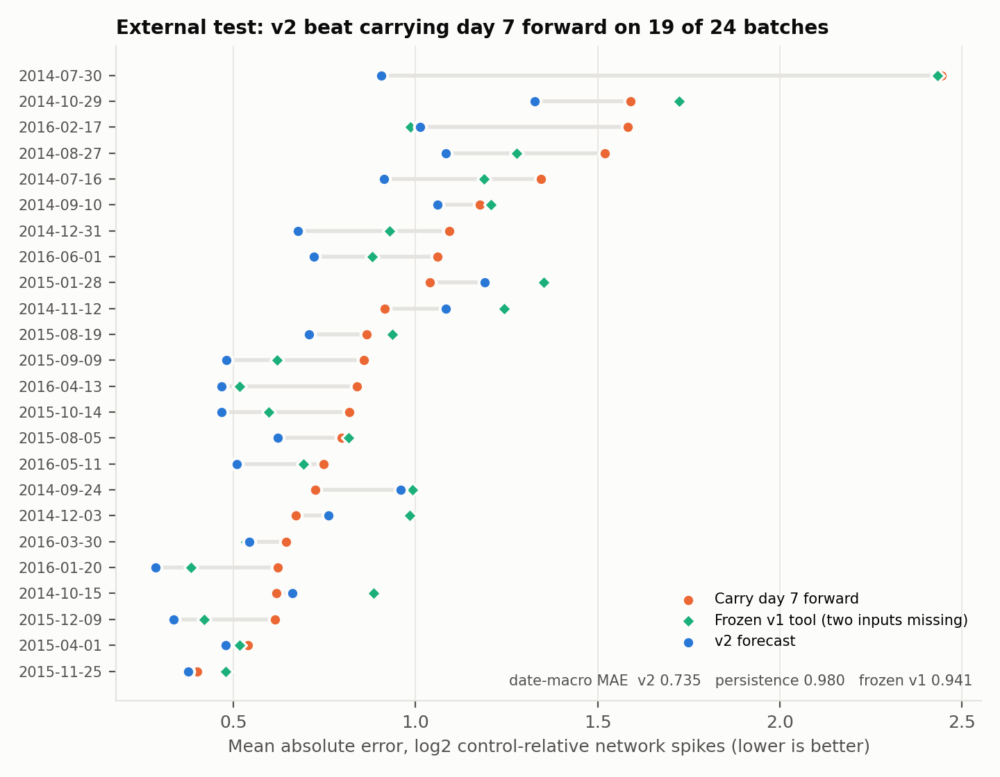
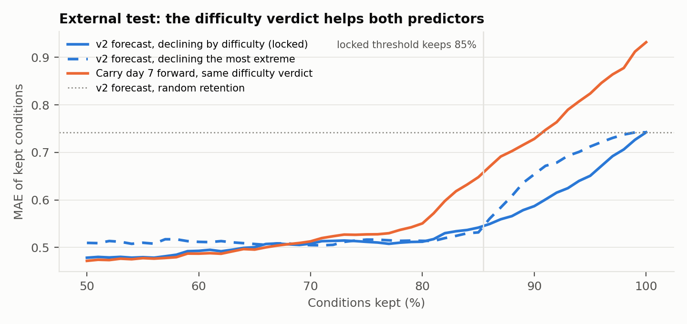
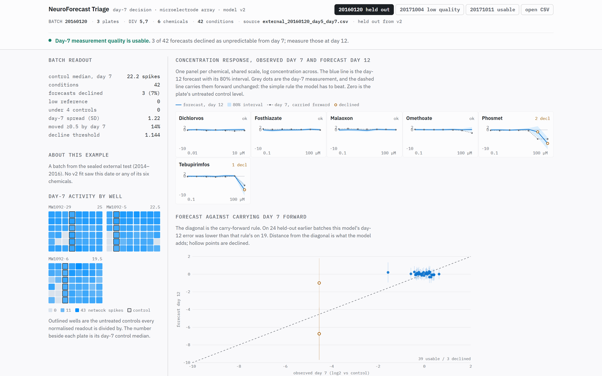
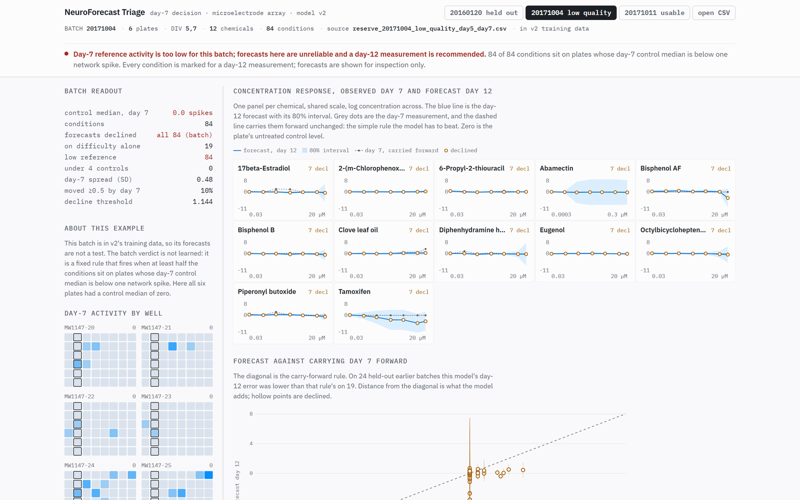
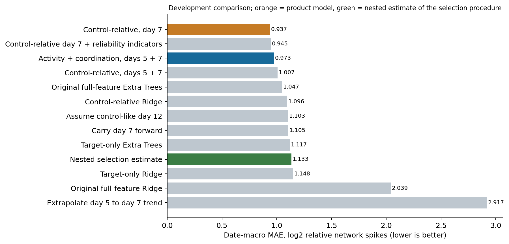

# NeuroForecast: day-7 forecasting and trust triage for neuronal network assays, tested on 27 sealed batches

**Submission category: Tool & Platform.**
AI4S Open Innovation: AI for Life Science (AI + Organ-on-a-Chip), 5th Pazhou Algorithm Competition.
Team: one person (GitHub [SaltyTaro](https://github.com/SaltyTaro)).
Code, models and evidence: <https://github.com/SaltyTaro/neuroforecast>.
Live tool (runs in the browser, no login): <https://saltytaro.github.io/neuroforecast/app/>.

---

## Summary

Neuronal networks grown on microelectrode arrays (MEAs) are the functional readout of the developmental-neurotoxicity in-vitro battery, and of the neural organ chips now being built to replace animal tests. A screen records each culture at days 5, 7, 9 and 12, and the day-12 result is the endpoint. By day 7, a researcher already has data and faces three questions:
- Is this batch's reference usable?
- What will day 12 show?
- Can that estimate be trusted?

**NeuroForecast answers all three at day 7, from day-5 and day-7 wells only.** It gives a batch quality verdict, a day-12 forecast with an interval beside the simple "carry day 7 forward" value, and a trust verdict that declines conditions it cannot predict.

We tested it twice, each time on data sealed before modelling, under hashed pre-registered criteria, scored exactly once:

| Sealed test | Batches | Conditions | Forecast MAE | Carry day 7 forward | Result |
| --- | ---: | ---: | ---: | ---: | --- |
| 1. Three later batches (v1 model) | 3 | 224 | 0.7716 | **0.6088** | the forecast **lost** |
| 2. Earlier batches, 105 never-seen chemicals (v2 model) | 24 | 927 | **0.735** | 0.980 | the forecast **won**: 25% lower error, 19 of 24 batches |

In the external test, declining the least predictable 15% of conditions cut error on the rest by 27% for our forecast and by 30% for the simple rule. The failures are reported as prominently as the passes:
- Intervals under-covered: 70% observed at a nominal 80%.
- An early-warning ranking for conditions still quiet at day 7 did not replicate.
- A day-7 chemical-level call reached 89.1% agreement with EPA's final call, short of the pre-registered 90%.

All 148 published numbers are recomputed from per-case evidence by a script in the repository. The external development run reproduces byte for byte from a fresh clone.

## 中文摘要

在微电极阵列（MEA）上培养的神经元网络，是发育神经毒性体外测试组合（OECD DNT-IVB）中唯一测量神经功能的读数，也是神经类器官芯片的核心读数。实验在第 5、7、9、12 天记录，第 12 天为终点。NeuroForecast 只用第 5 天和第 7 天的数据，在第 7 天给出三项判断：本批次对照是否可用（质控）；第 12 天的预测值及区间，并与"沿用第 7 天读数"的持续性基线并列显示；以及该预测是否可信（不可信则拒绝预测，建议实测第 12 天）。

我们做了两次封存测试。每次都在建模前封存数据、预先登记并哈希锁定评估标准，且只评分一次。

- 第一次（3 个较晚批次）：模型输给了持续性基线（0.7716 对 0.6088），我们如实报告。
- 第二次（24 个更早批次、105 种从未见过的化合物）：v2 模型误差比持续性基线低 25%（0.735 对 0.980），在 19/24 个批次上更优。拒绝预测最难的约 15% 条件后，其余条件的误差下降 27–30%。

未通过的项目同样报告：预测区间覆盖率不足（名义 80%，实测 70%），早期预警未能复现，第 7 天化合物判定一致率为 89.1%，未达到 90% 的预设门槛。

全部 148 个公开数字均可由仓库脚本从逐条件证据表重新计算。代码、模型和浏览器工具全部公开，免登录，可在 CPU 上复现。

---

## 1. The problem: a day-7 reading, and a decision

### 1.1 Who is deciding what

The EPA **network formation assay (NFA)** plates rat cortical neurons on 48-well MEA plates. It exposes them to a chemical at seven concentrations and records spontaneous network activity at days *in vitro* (DIV) 5, 7, 9 and 12 while the network forms. It is one of the 17 assays of the developmental-neurotoxicity in-vitro battery described in the [OECD's 2023 initial recommendations](https://www.oecd.org/en/publications/initial-recommendations-on-evaluation-of-data-from-the-developmental-neurotoxicity-dnt-in-vitro-testing-battery_91964ef3-en.html). It is also the battery's only [assay of neural *function*](https://www.frontiersin.org/journals/toxicology/articles/10.3389/ftox.2026.1919390/full), rather than morphology. The endpoint is how far each condition's day-12 activity departs from its plate's untreated controls.



By day 7 the lab has two recordings and five more days of culture ahead. Three decisions are available at that moment:

- **Is this batch's reference usable?** If the untreated control wells are silent, every control-relative number from that plate is degenerate. A lab would want to know now, not after day 12.
- **What will day 12 show, and how sure is that?** A forecast is only usable with a statement of its reliability and beside the simplest alternative: assume nothing changes after day 7.
- **Which conditions cannot be anticipated?** Those are the ones where the day-12 recording carries the information. The rest can be triaged, reported early or reviewed first.

### 1.2 Why this matters for organ-on-a-chip

Neural organ chips produce the same kind of data: multi-electrode recordings of a developing network, under exposure, over days. The organ-chip field names **data quality and comparability** as its central bottleneck. Chinese organ-chip leaders say so directly ([Science and Technology Daily, September 2026](https://www.stdaily.com/web/gdxw/2026-09/23/content_586784.html)). The challenge sponsor describes data assets and AI digital twins as the goal.

A digital twin, or a data asset, needs a layer that says which readouts can be trusted, and when a forecast should not be believed. NeuroForecast is that layer for MEA network readouts. It gives a batch-level verdict from the day-7 controls, a per-condition forecast with a comparator, and a per-condition refusal to forecast. Everything is tested on held-out batches, which is the unit that varies between chip runs.

We use public plate data because it is the largest longitudinal, chemically perturbed, functional dataset available under a public-data rule. It also supports two independent sealed tests. **Transfer to chips is not validated here.** §10 sets out what would change for a chip run and what would have to be re-tested.

### 1.3 What we claim, and what we do not

We claim a day-7 triage tool and the evidence from two sealed tests:
- The forecast beat carry-forward on 24 earlier batches, and lost on 3 later ones.
- Abstention transferred in both tests.
- The batch quality flag caught the one collapsed batch; no external batch tested it.

We do not claim saved recordings, wells or cost; toxicity, irreversibility or recovery; human or chip validity; or a new learning algorithm.

---

## 2. Prior work and the boundary of our claim

| Prior work | What it establishes | What is left for us |
| --- | --- | --- |
| [Early prediction of developing spontaneous activity in cultured neuronal networks (2021)](https://doi.org/10.1038/s41598-021-99538-9) | Later firing and synchrony can be predicted from early recordings; 47 dishes, 12 cultures. | Generic early forecasting is not new. We add chemical exposure, unseen chemicals, unseen batches, and a decision with a refusal option. |
| [Frank et al. 2017, 86-compound network screen](https://doi.org/10.1093/toxsci/kfx169) | Longitudinal MEA screening; combinations of activity and coordination features. | Combining MEA features is not new. It is why our strongest comparator is a small activity/coordination model. |
| [Toxicological tipping points in network development (2018)](https://doi.org/10.1016/j.taap.2018.01.017) | Tipping points and recovery trajectories. | We claim no tipping-point, irreversibility or recovery result. |
| [Shafer et al. 2019](https://doi.org/10.1093/toxsci/kfz052) and the [EPA NFA refinement analysis](https://github.com/USEPA/CompTox-DNT-NFA-Refinement) | The data, the dose-response analyses, and EPA's day-7/day-12/AUC hit calls. | The data and the chemical effects are prior work. Ours is the day-7 decision, the reliability layer, and the evaluation. |
| Split-conformal prediction; selective prediction | Distribution-free intervals under exchangeability; abstention. | Standard methods. We calibrate them under simultaneous batch and chemical shift and report observed per-batch coverage, including where it falls short. |

Extra Trees, control normalization, conformal intervals and abstention are implementation choices. **The contribution is the day-7 triage workflow, and an evaluation strict enough to show where it works and where it does not.**

---

## 3. Data

### 3.1 Two public releases of one assay

1. **The v1 archive:** EPA NFA, [DOI 10.23719/1503191](https://doi.org/10.23719/1503191), accompanying Shafer et al. (2019).
   - Archive SHA-256 `fd92c133…8cfb`, checked on every load.
   - It covers 17 experiment dates from 2016–2017.
   - US public domain under the [ScienceHub licence statement](https://pasteur.epa.gov/license/sciencehub-license.html).
2. **The EPA refinement release:** [USEPA/CompTox-DNT-NFA-Refinement](https://github.com/USEPA/CompTox-DNT-NFA-Refinement), pinned to commit `01adf3e`, file `All_DIV_Data.Rdata` (SHA-256 `fe8015c7…2af6`).
   - It re-processes the same recordings. On the 17 shared dates, 16,983 physical rows match, per-readout correlations run from 0.988 to 0.9997, and network-spike counts typically differ by one.
   - It adds **28 experiment dates from 2014–2016** that no NeuroForecast model had seen.
   - It lacks two readouts that v1 uses (`cv.time`, `cv.network`) and adds normalized mutual information (`mi`).
   - The repository has no licence file. The data were produced by the EPA, so we treat them as a US-Government work, cite them to EPA, and report the missing licence as a limitation.

### 3.2 Audit

Loading refuses to proceed on surprises:
- **v1 archive:** 17,224 rows reduce to 17,128 recordings after 96 exact duplicates are removed (the same Valinomycin wells under two aliases), giving 4,320 physical wells and 136 substances. Three substances whose identities conflict between source tables are excluded, not silently resolved. Three unmapped PFAS names are excluded, as the original analysis also did.
- **Refinement release:** 31,756 rows reduce to 31,600 after duplicate removal. All 267 EPA sample IDs resolve to a DSSTox substance ID through the release's own tables. Our 136 CAS identities link one-to-one through shared wells.
- **Both:** silent wells stay in the data, because a dead culture is a real outcome. Missing burst metrics stay missing, with explicit missingness features.

### 3.3 Units of independence

A **condition** is an experiment date, a chemical and a positive concentration, aggregated over at least two replicate wells. Conditions on one date share plates, controls and culture preparation. We therefore count **experiment dates (batches)** and chemicals as evaluation units, never wells or doses. Dates are the strongest grouping in the public files. They are not verified independent donors or litters.

### 3.4 Cohorts

| Role | Dates | Conditions | Chemicals |
| --- | ---: | ---: | ---: |
| v1 development | 12 (2016–2017) | 819 | 101 |
| **Sealed test 1**: v1 reserve | 3 (Sept–Oct 2017) | 224 | 32 |
| v2 development (all 17 known dates, EPA refinement copy, usable targets) | 17 | 1,260 | 138 |
| **Sealed test 2**: external, primary cohort | 24 (2014–2016) | 927 | 105, none seen in development |



---

## 4. Method

### 4.1 Endpoint

For each well and day, the control-relative ratio is `(ns.n + 1) / (same-plate same-day zero-dose median ns.n + 1)`, where `ns.n` is the network-spike count. It is averaged over a condition's replicate wells and then log2-transformed. The day-12 value is the target. The day-7 value is both a feature and the **persistence** comparator.

A **usable reference** means the day-12 plate control median is at least 5 network spikes. That rule uses a future observation, so it only decides which targets are trustworthy enough to *score*; it never enters a feature or a decision. Two analysis thresholds were fixed in the first protocol:
- a later large change is `|target| ≥ 1`;
- a condition is **quiet at day 7** if `|day-7 value| < 0.5`.

### 4.2 Information available at the decision

The model sees day-5 and day-7 readouts, the same-plate same-day zero-dose controls, and log10 concentration. For every readout it uses a control-relative contrast, `(raw − control)/(|raw| + |control|)`. That quantity is bounded, and invariant to a unit change applied to a readout and its controls, which the audit checks numerically. It also uses missingness fractions, seven day-7 reliability indicators (replicate count and spread, plate-control statistics), and three batch summaries of the day-7 inputs.

**Excluded by construction:** chemical identity, plate and date identifiers, any day-9 or day-12 measurement or control, viability, and published potency. The tool rejects day-9 and day-12 rows on input.

### 4.3 Components

**(a) Batch quality verdict.** If the day-7 control median is below one network spike on most of a batch's plates, the batch verdict is "reference too low; measure day 12". Every condition in that batch is then shown as declined.

**(b) Forecast, always beside the comparator.**
- **v1:** Extra Trees (256 trees, depth 12, minimum leaf 4, fixed seed) on the day-7 contrasts.
- **v2:** chosen by a rule fixed before development from five learned and two trivial candidates. The rule selected the **activity/coordination Extra Trees**: firing rate, correlation, active and bursting electrodes, and network spikes, at days 5 and 7, plus dose. It was refit on all 17 known batches of the refinement copy.
- Hyperparameters were fixed in the first protocol and never tuned.
- Persistence is computed and printed beside every forecast.

**(c) Trust verdict and intervals.** A difficulty model σ(x) is the same learner fitted to out-of-fold absolute residuals. For v2 it uses the day-7 features, reliability indicators and batch summaries. Conditions above the locked 80th percentile of development difficulty are **declined**.

Split-conformal intervals use difficulty-scaled scores `|residual|/σ`. Every calibration residual comes from a model that never saw that condition's batch or chemical.

**(d) Early-warning ranking (tested, withdrawn).** This ranks quiet-at-day-7 conditions by forecast magnitude at a 20% review budget. It passed on sealed test 1, on ten positives in one batch, and failed on sealed test 2. The v2 tool does not ship it.

### 4.4 Implementation

**Frozen cores.** Audited loading, case construction, purged splits and the representation are hash-recorded and imported unchanged by every later stage.

**Evaluation code.**
- The v1 gate (`neuroforecast_gate.py`) and the v2 pipeline (`neuroforecast_v2.py`, `neuroforecast_v2_external.py`) write lock files with the hashes of code, protocol, prepared data, models and every operating point.
- Unsealing requires an unchanged lock, an explicit `--unseal` flag, and no existing outputs. It runs once.

**Tools.**
- `neuroforecast_triage_v2.py` (command line) and the browser app load only the shipped bundle.
- The browser app evaluates the forests in JavaScript, entirely on the user's machine. Its outputs are tested against Python on every sealed condition.

**Runtime and cost.** On one CPU, v2 development takes 168 s with four processes; external scoring takes seconds; the tool takes under a second per batch. No GPU, cloud or paid service was used at any point.

---

## 5. How the evaluation was kept honest

**Splits.** Every fold leaves out one batch *and* purges that batch's chemicals from training everywhere. The primary metric is **date-macro MAE**: absolute error averaged over doses within a chemical, then over chemicals within a batch, then equally over batches. This keeps a large batch or a many-dose chemical from dominating.

**Sealing, twice.**

| Step | Sealed test 1 (v1 gate) | Sealed test 2 (v2 protocol) |
| --- | --- | --- |
| Held-out set chosen | the 3 latest dates, from metadata, before any model | 28 dates found in a second release; only counts and IDs read |
| Criteria hashed | before the development run; one dated amendment before unsealing (split bundled criteria; no data or threshold changed) | 16:15:58 UTC, September 27, before any development run |
| Development lock | hashes of code, data, models, thresholds | 16:22:20 UTC; scoring code frozen 16:23:57 UTC with the hashes of the unchanged v1 tool |
| Scored | once, September 21 | once, September 27 |

The v2 protocol added a sealed replication of the **unchanged v1 tool** (Arm A) beside the new components (Arm B). It also disclosed the only external information seen before unsealing: counts and IDs, and one EPA plate-exclusion note.

**Audits.**
- **Leakage.** The v1 audit deletes every observation after day 7, then mutates every future value and control, and requires bit-identical inputs both times. The v2 audit confirms that no external condition, date or chemical reached any fit.
- **Replay.** Saved models reproduce their recorded forecasts to within 9e-16.
- **Reproducibility.** A fresh v2 `prepare` and `develop` from the public repository reproduces every prepared file, every out-of-fold prediction and all five model files **byte for byte**.
- **Verified numbers.** `verify_published_numbers.py` recomputes 148 published numbers from the per-case evidence tables at the precision each is quoted to. It caught three drifts in our own drafts before publication.

---

## 6. Sealed test 1: three later batches (v1)

| Date-macro MAE | 20170920 | 20171004 | 20171011 | Mean |
| --- | ---: | ---: | ---: | ---: |
| **Carry day 7 forward** | **0.424** | 0.680 | 0.722 | **0.6088** |
| v1 product model | 0.583 | 1.057 | **0.674** | 0.7716 |
| Small activity/coordination model | 0.600 | 1.107 | 0.694 | 0.8005 |
| Assume no change from control | 0.863 | **0.604** | 1.278 | 0.9150 |



**The forecasting criterion failed.** The model's own error held steady: 0.7635 on development conditions with a usable day-12 reference, 0.7716 here. What moved was the comparator: persistence went from 1.0571 to 0.6088. Two of the three batches were unusually persistent (day-7 to day-12 correlation 0.97 and 0.92, against 0.23–0.88 on development batches). On them the true day-12 value rose about 1.3 log2 units per unit of day-7 change, while v1's forecasts rose only 0.87–0.94.

The third batch, **20171004**, failed for a different reason:
- All six plates had a day-7 control median of exactly zero network spikes, and 69 of its 84 day-7 values were zero.
- By day 12 the same plates had recovered to medians of 23.5–53.5.
- The low-reference-activity flag was fixed on development and uses day-7 controls only. It fired on all 84 of that batch's conditions and on no others, before any day-12 data existed.
- On the 140 unflagged conditions persistence still won (0.573 against 0.629). The flag explains the worst batch, not the whole loss.

**What held.** Abstention declined 14% of conditions carrying 51% of the error. It cut the model's kept-condition error by 43% and persistence's by 27%. A zero-parameter rule that declines the most extreme forecasts did about as well (0.456 against 0.446). Intervals observed 0.714 coverage at a nominal 0.80, a shortfall.

The quiet-condition early warning found 6 of 10 later large changes. All ten were on the collapsed batch, and flagging the highest doses first would have found 3.6.

---

## 7. Sealed test 2: 24 earlier batches, 105 unseen chemicals

### 7.1 Before unsealing: what the external copy does to the frozen v1 tool

We ran the unchanged v1 tool on the refinement copy of the *already spent* reserve. This validates nothing new; it measures the handicap the external test would carry.

| Reserve, re-scored | v1 MAE | Persistence | Declined | Low-activity flags |
| --- | ---: | ---: | ---: | ---: |
| v1 archive (audited) | 0.7716 | 0.6088 | 32 | 84 |
| Archive without `cv.time`/`cv.network` | 0.7904 | 0.6088 | 32 | 84 |
| Refinement copy | 0.8200 | 0.6086 | 33 | 84 |

The flag and the abstention count transfer unchanged. The v1 forecast carries a disclosed handicap of about 0.05, written into the protocol before unsealing.

### 7.2 Development (17 known batches; refinement copy; usable targets)

| Candidate | Date-macro MAE |
| --- | ---: |
| Carry day 7 forward | 1.064 |
| Assume no change | 1.385 |
| v1 architecture, refit | 0.745 |
| **Small activity/coordination model (selected)** | **0.726** |
| Persistence-anchored residual | 0.731 |
| Batch-adaptive blend of v1 refit and persistence | 0.742 |
| Anchored residual with batch summaries | 0.810 |
| **Nested estimate of the selection procedure** | **0.770** |

The nested estimate re-runs the whole selection inside each held-out batch. It chose the small model 6 times, the blend 9 times and two others once each, and it scores 0.770. That is the honest development expectation, and it beats persistence by a wide margin. The difficulty model narrowly beat "decline the most extreme" on the pre-registered retention–error metric (0.504 against 0.513), so it was locked.

### 7.3 Forecast

| Predictor (primary cohort, 927 conditions) | Date-macro MAE | Batches better than persistence | Paired batch difference vs persistence, 95% |
| --- | ---: | ---: | --- |
| Carry day 7 forward | 0.980 | — | — |
| Assume no change | 1.403 | — | — |
| Frozen v1 tool (two inputs missing) | 0.941 | 14 of 24 | −0.130 to +0.052 |
| **v2 product** | **0.735** | **19 of 24** | **−0.396 to −0.123** |
| v1 architecture refit on the same inputs (comparator) | 0.706 | — | — |



**The v2 forecast cut error by 25% relative to carrying day 7 forward, and its interval excludes zero.** The frozen v1 tool, missing two inputs, edged persistence out with an interval that includes zero.

The comparator row matters for the innovation claim. The v1 architecture refit on the same data did slightly better than the product, 0.706 against 0.735, with an interval of the difference that includes zero. **The gain over v1 comes from refitting on processing-consistent data from more batches, not from a better model class.** Results on the six chemicals shared with development (56 conditions) agree: 0.724 against 0.978.

### 7.4 Trust and abstention

| Declining at the locked threshold | Declined | Kept MAE | All MAE | Error reduction |
| --- | ---: | ---: | ---: | ---: |
| v2 forecast | 135 | 0.541 | 0.742 | 27% |
| Carry day 7 forward, same verdict | 135 | 0.655 | 0.932 | 30% |
| Frozen v1 tool, its own verdict | 120 | 0.640 | 0.907 | 29% |
| Carry day 7 forward, v1 verdict | 120 | 0.717 | 0.932 | 23% |

The conditions v2 declined had an MAE of 1.921, against 0.541 for those it kept: 3.5 times higher. They carried 38% of all forecast error. Kept conditions have a median absolute error of 0.41 log2, about a 1.33-fold error in the control-relative readout.

In v2 the learned difficulty model beat the zero-parameter extremity rule over the whole retention range (area 0.542 against 0.562). In v1 the two tied (kept MAE 0.640 against 0.641).



### 7.5 What failed

- **Early warning among quiet conditions.** v1 found 16.0 of 65 later large changes and v2's locked score found 14.0, against 16.6 for flagging the highest doses first, 21.0 for day-7 magnitude and 14.8 by chance. The claim is withdrawn, and the v2 tool does not ship the list.
- **Intervals** observed 0.666 (v1) and 0.702 (v2) coverage at a nominal 0.80, and 0.812 at 0.90. Under batch shift they are approximate, as on the reserve.
- **The day-7 chemical call** covered 106 EPA samples, 72 of them active by EPA's final area-under-curve call.
  - EPA's own day-7 hit call, applied to every sample, agreed with the final call 87.7% of the time.
  - Our locked policy decided 95.3% of samples at day 7 with 89.1% agreement, below the pre-registered 90%. It reaches 96.0% agreement against the stricter reference of three or more active endpoints.
  - Most of the policy's work was done by EPA's own day-7 hit count. Our forecast gate changed no decision.
  - We claim no recording-time saving.
- **The quality flag** was not testable: no external batch had silent day-7 controls.

### 7.6 Every criterion, as pre-written

| Criterion | Result |
| --- | --- |
| A1 frozen v1 beats persistence | **PASS**, marginally; the interval includes zero |
| A2 abstention reduces error for v1 (≥20%) and for persistence (≥10%) | **PASS** (29%, 23%) |
| A2b difficulty model beats the extremity rule | **PASS**, by 0.001, which is a tie |
| A3 quality flag separates hard conditions | not testable |
| A4 v1 early warning beats the dose rule | **FAIL** |
| A5 v1 coverage ≥ 0.70 | **FAIL** (0.666) |
| B1 v2 beats persistence overall and on most batches | **PASS** (0.735 against 0.980; 19 of 24) |
| B1b v2 beats v1 | below the frozen v1 tool; **not** below v1 refit on the same inputs |
| B2 difficulty model beats the extremity rule and random retention | **PASS** |
| B3 v2 early warning beats the dose rule | **FAIL** |
| B4 day-7 call ≥ 90% agreement on ≥ 25% of samples | **FAIL** (89.1% on 95.3%) |
| B5 v2 coverage ≥ 0.75 | **FAIL** (0.702) |

---

## 8. What the two tests say together

1. **Neither predictor wins everywhere, so the tool always shows both.** On three later batches, persistence won. On 24 earlier batches with new chemicals, the model won by a quarter. The per-batch picture (figure in §7.3) shows persistence winning 5 of the 24 external batches as well.
   - *Descriptive only:* external batches were about as persistent overall as the reserve (pooled day-7/day-12 correlation 0.84 against 0.87; development 0.66). So persistence alone does not explain the reserve result.
   - v1's under-reaction on the reserve's persistent batches and the degenerate 20171004 are the more likely causes. Large changes were also twice as common externally (27.5% of conditions against 13.8%).
2. **Abstention is the most reproducible component.** It held in both tests and in both external arms, and it cut kept-condition error by 23–30% for every predictor, including persistence. It is a statement about which outcomes are predictable, not only about our model's weak spots.
3. **Claims that rested on one batch did not survive.** The early-warning result (ten positives, one batch) did not replicate. The quality flag (one event) remains untested. We report both that way.
4. **Intervals under-cover under batch shift**, at 0.67–0.71 against 0.80 in all three measurements. A deployment should recalibrate on the lab's own batches.

---

## 9. The tool

### 9.1 What it does

`tools/neuroforecast_triage_v2.py` and the [browser app](https://saltytaro.github.io/neuroforecast/app/) take a well-level CSV of day-5 and day-7 readouts with their zero-dose controls. They reject day-9 and day-12 rows and return:
1. a **batch verdict** from the day-7 controls, with the reference activity level;
2. per condition, the **day-12 forecast** with an 80% interval, the **carry-forward** value beside it, a **difficulty** score, and a verdict: *forecast usable* or *declined: measure day 12 directly*;
3. the **held-out evidence**, printed on every run, including the test the model lost.

The browser app runs the same forests in JavaScript on the user's machine, with no upload and no login. It shows the plate maps and, for each chemical, the concentration–response panel read by the assay: day-7 observations, the day-12 forecast with its interval, and declined points ringed.

A test replays all 1,228 sealed conditions through the JavaScript port and fails if any output differs from Python by more than 1e-6. The observed difference is zero: the port is bit-identical.





### 9.2 A held-out batch that passes, and a batch that does not

The first run is a batch from 2016-01-20, which v2 never saw:

```
Batch 20160120: 42 conditions, day-7 reference activity 22.2 network spikes
  measurement quality: day-7 measurement quality is usable
  3 of 42 forecasts declined as unpredictable
    chemical                         uM    day 7  forecast       80% interval  verdict
    Dichlorvos                        3    -0.58     +0.04     [-0.64, +0.72]  forecast usable
    Fosthiazate                     0.3    +0.22     -0.33     [-0.99, +0.34]  forecast usable
```

On this batch, v2's MAE was 0.286 against 0.622 for carrying day 7 forward.

The second run is the batch whose cultures had not started firing at day 7:

```
Batch 20171004: 84 conditions, day-7 reference activity 0.0 network spikes
  measurement quality: day-7 reference activity is too low for this batch;
                       forecasts here are unreliable and a day-12 measurement is recommended
```

Every condition in that batch is shown as declined. v2 was trained on this batch, but the verdict does not depend on that: it comes from a fixed rule on the day-7 controls.

---

## 10. Impact, and the path to organ-on-a-chip use

**Who uses it, and for what.** A screening lab running the NFA, or any longitudinal MEA exposure study, uses it at the day-7 recording.

In the external test, the tool:
- gave a usable day-12 estimate for 85% of conditions, with a median error of about 1.33-fold;
- marked the other 15%, which carried 38% of the error, for the day-12 measurement to decide;
- declined 1 to 12 conditions per batch (5.6 on average), which is a reviewable list rather than a wall of numbers.

A batch whose reference is silent at day 7 is flagged before five more days of culture. The v1 reserve contained one such batch in three.

**What it does not yet save.** The chemical-level early call fell just short of its bar, so we claim no recording days, wells or cost.

**Mapping to a neural chip.** The tool's inputs are the summary readouts any MEA analysis produces:
- **Batch** becomes the chips seeded and recorded together.
- **Reference** becomes the vehicle-treated chips in that run.
- **Condition** becomes a compound and concentration.

What must be re-established on chips:
- the minimum number of vehicle chips per run (the plate version uses four or more control wells per plate);
- the reliability thresholds, recalibrated on the lab's own batches;
- the forecast, re-validated in a sealed test like ours before any claim.

The batch-quality and abstention logic depend only on control activity and on out-of-fold residuals. They are the parts most likely to carry over.

**How many controls does it need?** This is a descriptive analysis on the already-scored external batches, not a validation. Keeping only *k* random untreated wells per plate at days 5 and 7 (five random draws each), with the same wells kept at both days, gave:

| Controls per plate | v2 forecast MAE | Carry-forward MAE | Declined | False "collapsed batch" verdicts (of 24) |
| --- | ---: | ---: | ---: | ---: |
| 1 | 0.733 | 1.118 | 18% | 1.2 |
| 2 | 0.738 | 0.985 | 15% | 0 |
| 4 | 0.733 | 0.977 | 12% | 0 |
| all (4–14) | 0.735 | 0.980 | 15% | 0 |

The forecast barely moves, even with one control. Carry-forward degrades because its reference gets noisier. **The batch verdict is the fragile part.** With a single control it raised false alarms, so a chip run needs at least two vehicle chips before that verdict means anything. The script is `tools/control_subsampling.py`, and its output is in `evaluation/v2_posthoc/`.

**Data assets and digital twins.** A digital twin trained on chip data inherits that data's failures. The day-7 verdict can serve as an admission rule for data assets: record which runs had a usable reference, which forecasts were declined, and why. Our evaluation discipline is itself reusable: hash-locked criteria, one-shot sealed tests, machine-verified numbers.

**Next steps.**
1. A prospective sealed test on a chip provider's neural chips, with the protocol written before the first recording.
2. Ingestion and quality control of human iPSC-derived neuron MEA data, starting with public datasets.
3. Extension from one readout (network spikes) to the full panel, with per-endpoint abstention.
4. Recalibration of intervals from each lab's first batches.

---

## 11. Limitations

- **Two sealed tests disagree on the forecast.** The larger one favours the model, but three later batches favoured persistence. Batch-level variation is real, so persistence stays on screen.
- **The early-warning claim is withdrawn**, and **the quality flag rests on one event.**
- **Intervals under-cover** under batch shift (0.67–0.71 at nominal 0.80).
- **The v2 gain is a refit, not a new model class.** The v1 architecture refit on the same data was as good.
- **One assay and one laboratory.** Dates are not verified independent donors or litters. Both sealed tests come from the same EPA program.
- **Target construction.** The pseudocount-regularized target can be inflated by near-zero controls; the usable-reference rule limits this without eliminating it.
- **Rat cortical cultures in plates** are not organ chips, human cells or clinical toxicity. No saved days, wells or cost are validated. Forecast magnitudes are not probabilities.
- **Licensing.** The refinement release carries no licence file; we rely on its status as a US-Government work.

---

## 12. Reproduction

All of this is CPU-only and needs no account or paid service.

```bash
git clone https://github.com/SaltyTaro/neuroforecast && cd neuroforecast
pip install -r tools/requirements-neuroforecast.txt
python -X utf8 -B tools/neuroforecast_triage_v2.py --input examples/v2/external_20160120_day5_day7.csv
python -X utf8 -B tools/verify_published_numbers.py        # 148 published numbers against the evidence
python -X utf8 -B -m unittest discover -s tests -v         # includes exact replays of both sealed tests
node tests/test_web_triage_v2.mjs                          # browser port against Python, every sealed condition
```

To re-run the external test from source, use `tools/fetch_epa_refinement.py`, which downloads the pinned EPA files (about 3 MB) and verifies their checksums. Then run `tools/reproduce_external.py` with `prepare`, `develop`, `freeze`, `external --unseal` and `audit`. `develop` takes about three minutes and is byte-reproducible.

The v1 gate reproduces from the v1 archive with `tools/fetch_epa_data.py` and `tools/neuroforecast_gate.py`.

The repository ships every protocol, lock file, model, prepared input and per-case output of both sealed tests.

---

## 13. Disclosure

**Data.** Two public EPA releases, cited above. No private, proprietary or request-only data was used.

**Code and compute.** Code is MIT licensed. No cloud or paid compute was used.

**What the author saw before unsealing the external test:** its dates, plate and chemical counts, chemical names and IDs, day-7 control counts, and one EPA plate-exclusion note naming an external plate. No other day-9 or day-12 value was read. The external scoring code was dry-run on a pseudo-external set built from development batches before the real unsealing.

**Earlier campaign work.** Two earlier approaches were built and failed their pre-registered gates: adaptive dose selection from cell-image profiles, and vessel-patch selection for an oxygen-transport model. Their reports are in `docs/history/`, and nothing from them is reused as a contribution.

**AI assistance.** Claude (Anthropic) was used throughout as a coding, analysis and drafting assistant. Every number in this report was produced by scripts in the repository, run on public data, and is checked against saved evidence by `verify_published_numbers.py`.

---

## Appendix A: v1 development details

- v1 development used 12 dates and 819 conditions.
- The product model scored 0.93711 against persistence 1.10480 and the small model 0.97339. The nested estimate of the selection procedure was 1.133, worse than persistence, so v1's selection was noise-limited.
- Early warning among quiet conditions found 22 of 45 later large changes, against 10 for persistence ranking.
- Coverage was 0.807 at a nominal 0.80, with per-date coverage from 0.50 to 0.96.
- The control-dispersion flag fired on exactly the 42 conditions of one plate group whose day-12 controls had collapsed. EPA's 2025 refinement analysis independently removed that plate (MW1160-23, 20160921), using day-12 controls.



Full v1 results: [neuroforecast_gate_results.md](neuroforecast_gate_results.md) and [neuroforecast_reserve_results.md](neuroforecast_reserve_results.md). Full v2 results: [neuroforecast_external_results.md](neuroforecast_external_results.md), with the intake audit in [external_intake_results.md](external_intake_results.md). The v2 protocol is [experiments/neuroforecast_v2_protocol.json](../experiments/neuroforecast_v2_protocol.json).
